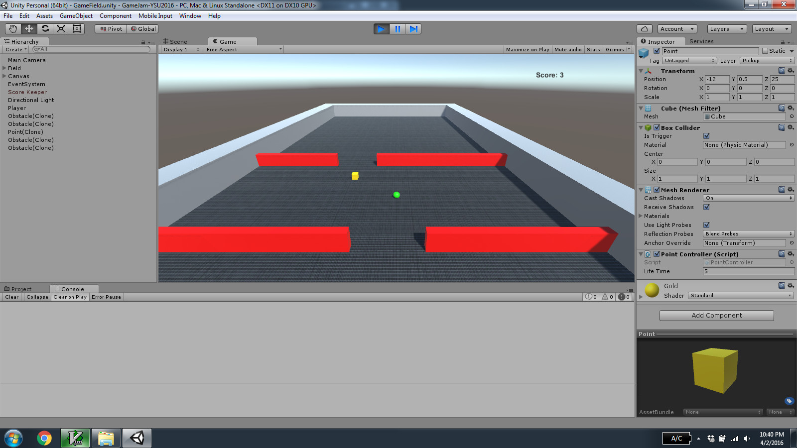
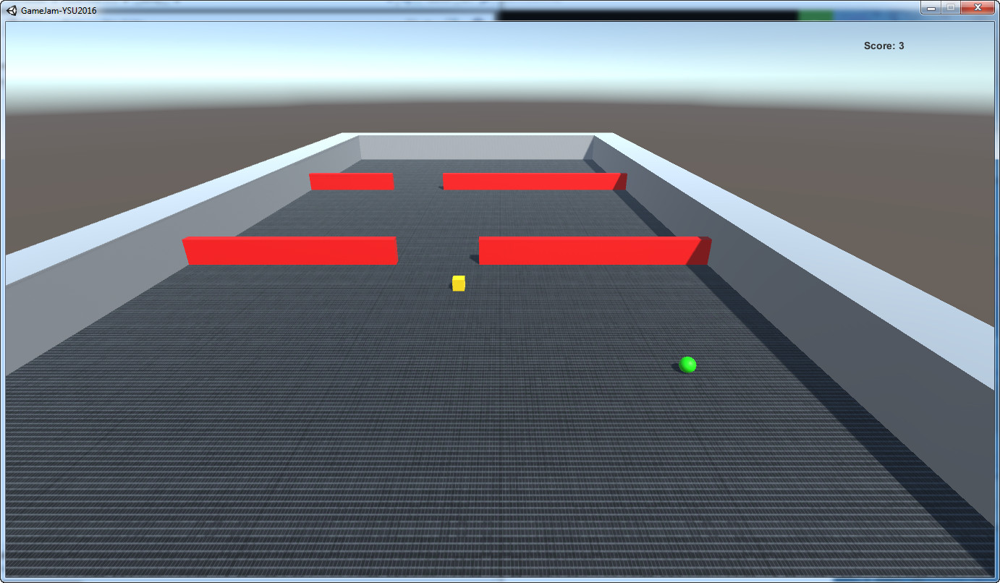

= GameJam-YSU2016

This is the repository for a game created during the 2016 YSU Game Jam (YGD Game Jam) put together by the http://www.meetup.com/Youngstown-Video-Game-Development-Meetup/[Youngstown Video Game Development Meetup] and http://ysu.edu/[YSU].

The theme of the game jam is **Locked In** and the game in this repository is named **Breakout**.

During the game jam, the original source control used was the http://fossil-scm.org/[Fossil] repository located at https://github.com/jeffrimko/GameJam-YSU2016/blob/master/Assets/game_jame-ysu_2016.fossil[Assets/game_jame-ysu_2016.fossil]. Notes were taken during the game jam and are available at https://github.com/jeffrimko/GameJam-YSU2016/tree/master/Assets/notes.adoc[Assets/notes.adoc].

